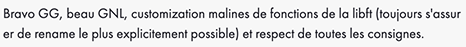

# get_next_line

Troixième projet de [42](https://42.fr/) dont le but est de recréer une fonction qui récupère la première ligne d'un fichier ainsi que la ligne suivante à chaque nouvel appel de la fonction.

---


#### Utilisation :

Voici la déclaration de la fonction ft_printf.

```
char	*get_next_line(int fd);
```

#### Paramètre :

- `fd` - Contient le [descripteur de fichier](https://fr.wikipedia.org/wiki/Descripteur_de_fichier).

#### Exemple d'utiliation :

```
#include <stdio.h>
#include "./get_next_line.h"
#include "./get_next_line.c"
#include "./get_next_line_utils.c"

int	main(void)
{
	int		i;
	int		fd;
	char	*out;

	fd = open("./harry-potter.txt", O_RDONLY);
	i = 0;
	while (i < 10702)
	{
		out = get_next_line(fd);
		printf("%s", out);
		free(out);
	}
	close(fd);
}

```

---
#### Diagrammes :

| Diagramme d'activité |
| --- |
|  |

---
#### Tests automatisés :

| [gnlTester](https://github.com/Tripouille/gnlTester) | 
| --- |
|  |
|  |

---
#### Correction :

| |
| --- |
|  |

| | |
| --- | --- |
| Moulinette |  |
| Correcteur 1 |  |
| Correcteur 2 |  |
| Correcteur 3 |  |